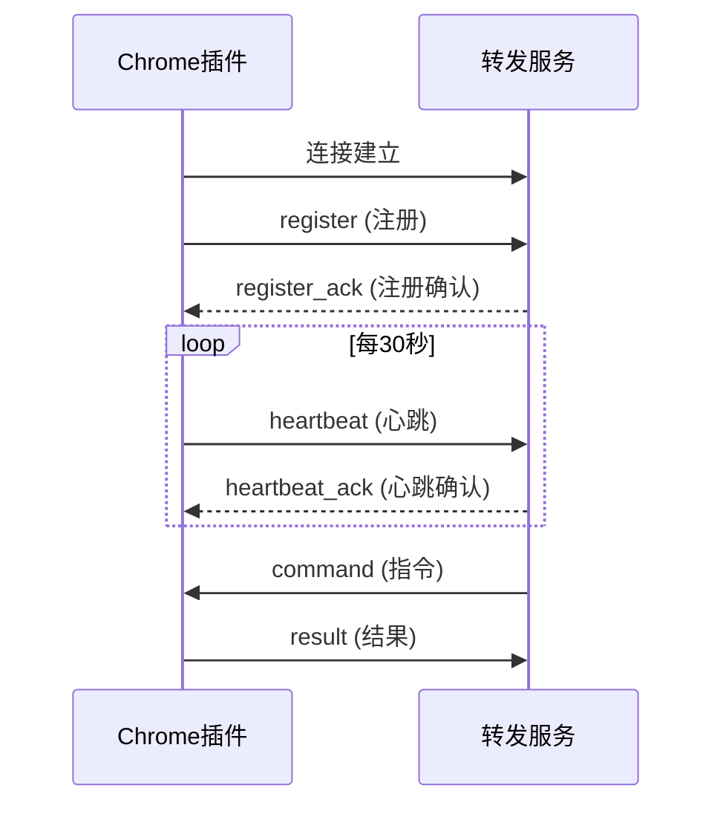

# Chrome DOM Diff - WebSocket通信协议文档

> **版本**: v1.0
> **日期**: 2024-02-08
> **作者**: 老王

---

## 目录

1. [概述](#1-概述)
2. [插件 → 转发服务](#2-插件--转发服务)
3. [转发服务 → 插件](#3-转发服务--插件)
4. [指令类型](#4-指令类型)
5. [错误处理](#5-错误处理)

---

## 1. 概述

### 1.1 连接信息

```
服务器地址: ws://127.0.0.1:8080
传输协议: WebSocket (RFC 6455)
数据格式: JSON (UTF-8编码)
```

### 1.2 通信流程



### 1.3 消息格式

所有消息都是JSON格式，包含以下基础字段：

```typescript
interface Message {
  type: string;        // 消息类型
  timestamp?: number;  // 时间戳（毫秒）
}
```

---

## 2. 插件 → 转发服务

### 2.1 插件注册 (register)

插件连接成功后立即发送此消息。

**请求:**
```json
{
  "type": "register",
  "plugin_id": "chrome-extension-xxxxxxxx-xxxx-xxxx-xxxx-xxxxxxxxxxxx",
  "tab_id": 123,
  "url": "https://www.amazon.com/product-page",
  "title": "Amazon Product Page",
  "capabilities": [
    "dom_capture",
    "xpath_query",
    "page_navigate",
    "dom_diff"
  ]
}
```

**响应:**
```json
{
  "type": "register_ack",
  "plugin_id": "chrome-extension-xxxxxxxx-xxxx-xxxx-xxxx-xxxxxxxxxxxx",
  "heartbeat_interval": 30,
  "timestamp": 1640000000
}
```

### 2.2 心跳 (heartbeat)

每30秒发送一次，用于保持连接。

**请求:**
```json
{
  "type": "heartbeat",
  "plugin_id": "chrome-extension-xxxxxxxx-xxxx-xxxx-xxxx-xxxxxxxxxxxx",
  "tab_id": 123,
  "timestamp": 1640000000
}
```

**响应:**
```json
{
  "type": "heartbeat_ack",
  "timestamp": 1640000000
}
```

### 2.3 结果上报 (result)

执行指令后发送结果。

**请求:**
```json
{
  "type": "result",
  "command_id": "cmd-uuid-xxxx",
  "status": "success",
  "timestamp": 1640000000,
  "data": {
    // 具体数据内容（根据指令类型不同）
  }
}
```

**状态值:**
- `success`: 执行成功
- `error`: 执行失败

---

## 3. 转发服务 → 插件

### 3.1 指令下发 (command)

转发服务向插件下发执行指令。

**请求:**
```json
{
  "type": "command",
  "command_id": "cmd-uuid-xxxx",
  "action": "dom_capture",
  "payload": {
    // 指令参数
  },
  "timestamp": 1640000000
}
```

### 3.2 注册确认 (register_ack)

```json
{
  "type": "register_ack",
  "plugin_id": "chrome-extension-xxxxxxxx-xxxx-xxxx-xxxx-xxxxxxxxxxxx",
  "heartbeat_interval": 30,
  "timestamp": 1640000000
}
```

### 3.3 心跳确认 (heartbeat_ack)

```json
{
  "type": "heartbeat_ack",
  "timestamp": 1640000000
}
```

---

## 4. 指令类型

### 4.1 DOM捕获 (dom_capture)

**请求:**
```json
{
  "type": "command",
  "command_id": "cmd-uuid-xxxx",
  "action": "dom_capture",
  "payload": {},
  "timestamp": 1640000000
}
```

**响应:**
```json
{
  "type": "result",
  "command_id": "cmd-uuid-xxxx",
  "status": "success",
  "timestamp": 1640000000,
  "data": {
    "tree_id": 1,
    "node_count": 1234,
    "duration": "2.45",
    "url": "https://www.amazon.com/product-page",
    "title": "Amazon Product Page"
  }
}
```

### 4.2 XPath查询 (xpath_query)

**请求:**
```json
{
  "type": "command",
  "command_id": "cmd-uuid-xxxx",
  "action": "xpath_query",
  "payload": {
    "xpath": "//h1[@id='productTitle']"
  },
  "timestamp": 1640000000
}
```

**响应:**
```json
{
  "type": "result",
  "command_id": "cmd-uuid-xxxx",
  "status": "success",
  "timestamp": 1640000000,
  "data": {
    "xpath": "//h1[@id='productTitle']",
    "count": 1,
    "results": [
      {
        "id": 42,
        "type": "element",
        "tag_name": "h1",
        "xpath": "//*[@id='productTitle']",
        "text_content": "Amazon Product Title",
        "attributes": {
          "id": "productTitle",
          "class": "product-title"
        },
        "attr_count": 2
      }
    ],
    "url": "https://www.amazon.com/product-page",
    "title": "Amazon Product Page"
  }
}
```

### 4.3 页面跳转 (page_navigate)

**请求:**
```json
{
  "type": "command",
  "command_id": "cmd-uuid-xxxx",
  "action": "page_navigate",
  "payload": {
    "url": "https://www.amazon.com/other-product",
    "wait_for_load": true
  },
  "timestamp": 1640000000
}
```

**响应:**
```json
{
  "type": "result",
  "command_id": "cmd-uuid-xxxx",
  "status": "success",
  "timestamp": 1640000000,
  "data": {
    "url": "https://www.amazon.com/other-product",
    "title": "Other Product Page",
    "tab_id": 123
  }
}
```

### 4.4 DOM差分准备 (dom_diff_prepare)

**请求:**
```json
{
  "type": "command",
  "command_id": "cmd-uuid-xxxx",
  "action": "dom_diff_prepare",
  "payload": {},
  "timestamp": 1640000000
}
```

**响应:**
```json
{
  "type": "result",
  "command_id": "cmd-uuid-xxxx",
  "status": "success",
  "timestamp": 1640000000,
  "data": {
    "message": "Prepared for diff"
  }
}
```

### 4.5 DOM差分计算 (dom_diff_compute)

**请求:**
```json
{
  "type": "command",
  "command_id": "cmd-uuid-xxxx",
  "action": "dom_diff_compute",
  "payload": {},
  "timestamp": 1640000000
}
```

**响应:**
```json
{
  "type": "result",
  "command_id": "cmd-uuid-xxxx",
  "status": "success",
  "timestamp": 1640000000,
  "data": {
    "changes": 15,
    "inserts": 8,
    "deletes": 5,
    "moves": 2,
    "duration": "5.23",
    "url": "https://www.amazon.com/product-page",
    "title": "Amazon Product Page"
  }
}
```

---

## 5. 错误处理

### 5.1 错误响应格式

```json
{
  "type": "result",
  "command_id": "cmd-uuid-xxxx",
  "status": "error",
  "timestamp": 1640000000,
  "data": {
    "error": "错误描述信息"
  }
}
```

### 5.2 常见错误码

| 错误信息 | 说明 |
|---------|------|
| `No active tab` | 没有活跃的标签页 |
| `XPath is required` | XPath表达式为空 |
| `URL is required` | URL参数为空 |
| `Unknown action: xxx` | 未知的指令类型 |
| `Capture failed` | DOM捕获失败 |
| `XPath query failed` | XPath查询失败 |

### 5.3 重连策略

| 场景 | 行为 |
|------|------|
| 连接失败 | 5秒后重试，最多10次 |
| 连接断开 | 自动重连，指数退避（5s, 10s, 20s...） |
| 心跳超时 | 立即重连 |
| 手动断开 | 不自动重连 |

---

## 附录

### A. 插件能力列表 (capabilities)

| 能力 | 描述 |
|------|------|
| `dom_capture` | DOM树完整捕获 |
| `xpath_query` | XPath查询 |
| `page_navigate` | 页面跳转 |
| `dom_diff` | DOM差分计算 |

### B. 配置参数

| 参数 | 默认值 | 说明 |
|------|--------|------|
| `serverUrl` | ws://127.0.0.1:8080 | 转发服务地址 |
| `heartbeatInterval` | 30000 | 心跳间隔（毫秒） |
| `reconnectInterval` | 5000 | 重连间隔（毫秒） |
| `commandTimeout` | 30000 | 指令超时（毫秒） |
| `maxReconnectAttempts` | 10 | 最大重连次数 |

---

**文档版本:** v1.0
**最后更新:** 2024-02-08
**维护者:** 老王
