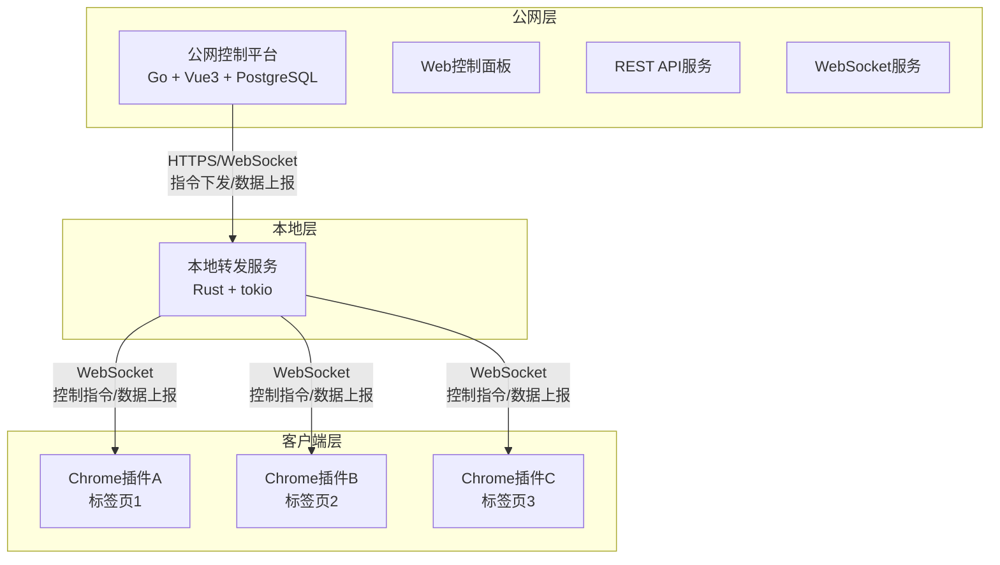
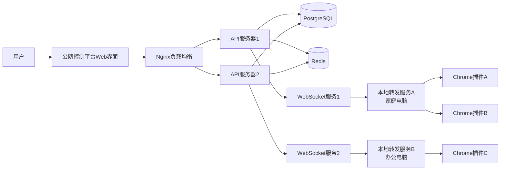
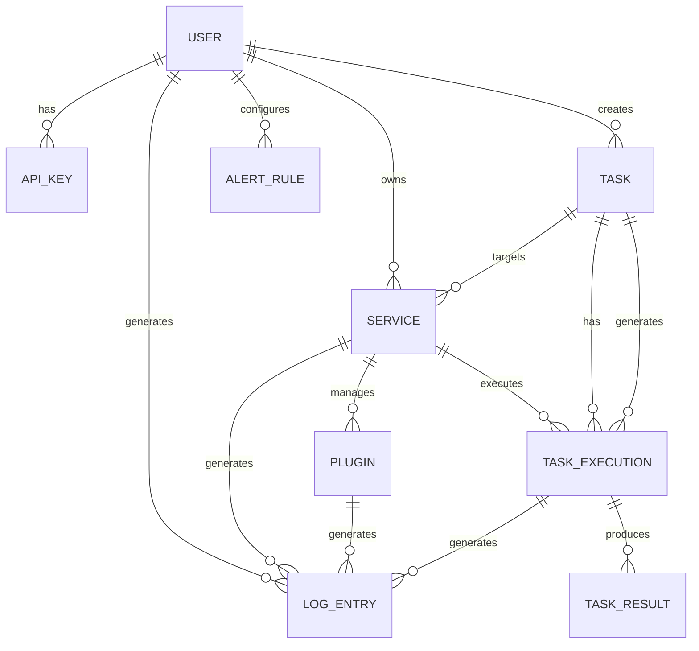

# Chrome DOM Diff 系统需求文档

> **项目代号**：反风控DOM抓取系统  
> **版本**：v1.0  
> **日期**：2024-02-08  
> **作者**：老王

---

## 📋 目录

1. [项目概述](#1-项目概述)
2. [系统架构](#2-系统架构)
3. [功能需求](#3-功能需求)
4. [数据模型](#4-数据模型)
5. [通信协议](#5-通信协议)
6. [非功能性需求](#6-非功能性需求)
7. [开发计划](#7-开发计划)

---

## 1. 项目概述

### 1.1 项目背景

随着网站反爬虫技术的不断升级，传统的HTTP请求爬虫面临着严峻挑战：
- **IP封禁**：高频请求导致IP被封
- **User-Agent检测**：识别爬虫特征
- **行为分析**：异常访问模式被识别
- **验证码挑战**：自动化操作被拦截
- **动态内容**：前端JavaScript渲染无法直接获取

**解决方案：** 利用真实的Chrome浏览器插件，模拟用户操作，绕过反风控检测。

### 1.2 目标用户

- **电商数据分析师**：抓取电商平台价格、库存、评价数据
- **市场研究人员**：监控竞争对手动态
- **内容审核人员**：自动化审核网页内容
- **测试工程师**：自动化测试Web应用

### 1.3 核心价值

✅ **真实浏览器环境**：使用Chrome插件，完全模拟真实用户操作  
✅ **分布式架构**：支持多设备、多插件并发工作  
✅ **中央化控制**：公网平台统一管理所有抓取任务  
✅ **安全性**：本地服务作为代理层，隔离风险  
✅ **可扩展性**：模块化设计，易于添加新功能  

---

## 2. 系统架构

### 2.1 三层架构



### 2.2 技术栈

#### 公网控制平台
| 组件 | 技术选型 | 说明 |
|------|---------|------|
| 前端 | Vue 3 + TypeScript | 响应式UI框架 |
| UI库 | Element Plus | 企业级组件库 |
| 状态管理 | Pinia | 轻量级状态管理 |
| 后端 | Go 1.21+ | 高性能并发 |
| Web框架 | Gin | 轻量级HTTP框架 |
| WebSocket | gorilla/websocket | 双向通信 |
| 数据库 | PostgreSQL 15+ | 关系型数据库 |
| 缓存 | Redis | 任务队列、缓存 |
| 部署 | Docker + K8s | 容器化部署 |

#### 本地转发服务
| 组件 | 技术选型 | 说明 |
|------|---------|------|
| 语言 | Rust | 内存安全、高性能 |
| 异步运行时 | tokio | 异步IO |
| WebSocket | tokio-tungstenite | 插件通信 |
| HTTP客户端 | reqwest | 连接公网平台 |
| 序列化 | serde | JSON序列化 |

#### Chrome插件
| 组件 | 技术选型 | 说明 |
|------|---------|------|
| WASM核心 | Rust | DOM差分算法 |
| 前端 | JavaScript (ES6+) | 插件逻辑 |
| 通信 | WebSocket API | 双向通信 |
| 存储 | IndexedDB | 本地数据缓存 |

### 2.3 部署架构



---

## 3. 功能需求

### 3.1 公网控制平台功能

#### 3.1.1 用户管理模块

**功能列表：**
- 用户注册/登录
  - 邮箱注册
  - GitHub OAuth登录
  - 忘记密码重置
  
- 角色权限管理
  - 管理员：所有权限
  - 普通用户：创建和管理自己的设备、任务
  - 只读用户：仅查看权限
  
- API密钥管理
  - 生成API密钥（UUID）
  - 设置密钥权限（read, write, admin）
  - 设置密钥过期时间
  - 撤销密钥
  
- 操作审计
  - 记录用户所有操作
  - 操作日志查询和导出
  
- 使用量统计
  - 任务执行次数
  - 数据查询次数
  - 设备在线时长

**数据模型：**
```rust
struct User {
    id: UserId,           // UUID
    email: String,        // 邮箱
    password_hash: String, // bcrypt哈希
    role: Role,           // Admin, User, ReadOnly
    created_at: DateTime,
    updated_at: DateTime,
    last_login: DateTime,
}

enum Role {
    Admin,
    User,
    ReadOnly,
}

struct ApiKey {
    id: ApiKeyId,         // UUID
    user_id: UserId,
    key: String,          // UUID v4
    name: String,         // 密钥名称
    scopes: Vec<Scope>,   // read, write, admin
    expires_at: Option<DateTime>,
    created_at: DateTime,
    last_used: Option<DateTime>,
}

enum Scope {
    ReadTasks,
    WriteTasks,
    ReadDevices,
    WriteDevices,
    ReadLogs,
    Admin,
}
```

#### 3.1.2 任务管理模块

**功能列表：**
- 任务创建
  - 选择任务类型：DOM捕获、XPath查询、页面跳转
  - 配置任务参数（URL、XPath、超时等）
  - 选择目标设备（或设备分组）
  - 设置调度策略（立即执行、定时执行、循环执行）
  - 保存为任务模板
  
- 任务调度
  - 立即执行：手动触发任务
  - 定时执行：Cron表达式（如 "0 0 * * * *" 每天零点）
  - 循环执行：每隔N秒/分钟/小时执行
  - 任务依赖：任务完成后触发下一个任务
  
- 任务监控
  - 实时查看任务执行状态
  - 查看任务执行日志
  - 查看任务执行结果（DOM数据、XPath结果）
  - 任务失败重试机制
  
- 任务历史
  - 查看历史执行记录
  - 导出执行结果（CSV、JSON）
  - 任务执行统计（成功率、平均耗时）

**数据模型：**
```rust
struct Task {
    id: TaskId,
    user_id: UserId,
    name: String,
    description: String,
    task_type: TaskType,
    config: TaskConfig,
    schedule: Schedule,
    status: TaskStatus,
    target_service: ServiceId, // 目标设备
    result: Option<TaskResult>,
    created_at: DateTime,
    updated_at: DateTime,
}

enum TaskType {
    DomCapture,      // DOM捕获
    XpathQuery,      // XPath查询
    PageNavigate,    // 页面跳转
    CustomCommand,   // 自定义命令
}

struct TaskConfig {
    url: String,
    xpath: Option<String>,
    wait_for_load: bool,
    timeout: u64,          // 毫秒
    retry_count: u8,
    retry_interval: u64,   // 毫秒
}

enum Schedule {
    Immediate,
    Cron(String),         // Cron表达式
    Interval(u64),        // 间隔秒数
    Dependent(TaskId),    // 依赖任务
}

enum TaskStatus {
    Pending,      // 等待执行
    Scheduled,    // 已调度
    Running,      // 执行中
    Completed,    // 完成
    Failed,       // 失败
    Cancelled,    // 已取消
}

struct TaskResult {
    status: ExecutionStatus,
    data: serde_json::Value,
    error: Option<String>,
    execution_time: u64, // 毫秒
    timestamp: DateTime,
}
```

#### 3.1.3 日志管理模块（集中管理）

**功能列表：**
- 日志采集
  - 自动采集平台日志
  - 接收本地服务上报的日志
  - 接收插件上报的日志
  
- 日志查询
  - 按时间范围筛选
  - 按日志级别筛选（Debug, Info, Warn, Error）
  - 按数据源筛选（平台、服务、插件）
  - 按任务筛选
  - 按用户筛选
  - 关键词搜索
  
- 日志展示
  - 实时日志流（WebSocket推送）
  - 日志高亮显示
  - 日志上下文展示
  
- 日志导出
  - 导出为CSV
  - 导出为JSON
  - 导出为TXT
  
- 日志告警
  - 配置告警规则（错误日志、关键词匹配）
  - 告警方式：邮件、Webhook
  - 告警历史记录
  
- 日志统计
  - 日志量趋势图
  - 错误日志占比
  - 服务健康度评分

**数据模型：**
```rust
struct LogEntry {
    id: LogId,
    timestamp: DateTime,
    level: LogLevel,
    source: LogSource,
    service_id: Option<ServiceId>,
    plugin_id: Option<PluginId>,
    task_id: Option<TaskId>,
    user_id: Option<UserId>,
    message: String,
    metadata: HashMap<String, String>,
    created_at: DateTime,
}

enum LogLevel {
    Debug,
    Info,
    Warn,
    Error,
}

enum LogSource {
    Platform,    // 平台日志
    Service,     // 本地服务日志
    Plugin,      // 插件日志
}

// 日志告警规则
struct AlertRule {
    id: AlertRuleId,
    user_id: UserId,
    name: String,
    conditions: AlertCondition,
    actions: Vec<AlertAction>,
    enabled: bool,
    created_at: DateTime,
}

enum AlertCondition {
    LevelEquals(LogLevel),
    ContainsKeyword(String),
    ServiceOffline(ServiceId),
    TaskFailed(TaskId),
}

enum AlertAction {
    Email { to: String },
    Webhook { url: String },
    SMS { to: String },
}
```

#### 3.1.4 设备插件管理模块

**功能列表：**
- 设备管理
  - 查看所有本地转发服务（设备）
  - 设备分组管理（如"生产环境"、"测试环境"）
  - 设备标签管理
  - 远程重启设备
  - 删除设备
  
- 设备状态监控
  - 实时查看设备在线状态
  - 查看设备CPU、内存使用率
  - 查看设备连接的插件数量
  - 查看设备网络延迟
  
- 插件管理
  - 查看设备连接的所有Chrome插件
  - 查看插件状态（活跃、非活跃、错误）
  - 查看插件当前URL、页面标题
  - 查看插件能力列表（DOM捕获、XPath查询等）
  
- 远程控制
  - 向设备下发指令
  - 向指定插件下发指令
  - 批量下发指令（所有插件、所有设备）
  - 实时查看指令执行结果

**数据模型：**
```rust
struct Service {
    id: ServiceId,
    user_id: UserId,
    name: String,
    description: String,
    status: ServiceStatus,
    version: String,
    ip_address: String,
    port: u16,
    last_heartbeat: DateTime,
    capabilities: Vec<String>,
    tags: Vec<String>,
    metadata: HashMap<String, String>,
    created_at: DateTime,
    updated_at: DateTime,
}

enum ServiceStatus {
    Online,        // 在线
    Offline,       // 离线
    Error,         // 错误
    Maintenance,   // 维护中
}

struct PluginInfo {
    id: PluginId,
    service_id: ServiceId,
    tab_id: u32,
    url: String,
    title: String,
    status: PluginStatus,
    capabilities: Vec<Capability>,
    last_heartbeat: DateTime,
    created_at: DateTime,
}

enum PluginStatus {
    Active,         // 活跃
    Inactive,       // 非活跃（标签页在后台）
    Error,          // 错误
}

enum Capability {
    DomCapture,     // DOM捕获
    XpathQuery,     // XPath查询
    PageNavigate,   // 页面跳转
}
```

### 3.2 本地转发服务功能

**功能列表：**
- WebSocket服务端
  - 监听本地插件的WebSocket连接（ws://127.0.0.1:8080）
  - 维护插件连接会话
  - 心跳检测
  
- HTTP客户端
  - 连接到公网平台（wss://platform.example.com）
  - 注册服务信息
  - 接收平台指令
  
- 消息转发
  - 平台 → 插件：转发指令
  - 插件 → 平台：上报数据
  - 插件A → 插件B：跨插件通信
  
- 数据缓存
  - 任务队列：缓存平台下发的任务
  - 结果缓存：暂存插件返回的数据
  - 批量上报：减少网络请求
  
- 日志上报
  - 收集插件日志
  - 上报到平台
  - 本地持久化（文件）

**核心数据结构：**
```rust
struct ForwardingServer {
    config: ServerConfig,
    platform_client: PlatformClient,
    plugins: HashMap<PluginId, PluginConnection>,
    task_queue: mpsc::Sender<Task>,
    result_cache: HashMap<TaskId, TaskResult>,
}

struct PluginConnection {
    ws: WebSocket,
    plugin_id: PluginId,
    tab_id: u32,
    url: String,
    capabilities: Vec<Capability>,
    last_heartbeat: Instant,
}
```

### 3.3 Chrome插件功能

**功能列表：**
- WebSocket客户端
  - 连接到本地转发服务
  - 注册插件信息
  - 心跳维持
  
- DOM捕获
  - 完整DOM树捕获
  - 元素属性提取
  - XPath计算
  
- XPath查询
  - 支持完整XPath 1.0语法
  - 实时查询结果返回
  
- 页面跳转
  - 执行跳转指令
  - 等待页面加载完成
  - 反馈新URL
  
- 指令执行
  - 接收服务器指令
  - 执行并返回结果

**已实现功能（v1.0）：**
- ✅ DOM完整捕获（属性+XPath+文本内容）
- ✅ 浏览器原生XPath引擎（完整XPath 1.0支持）
- ✅ XPath查询UI（预设按钮+自定义输入）
- ✅ 差分计算（插入/删除/移动）
- ✅ 性能监控

**待实现功能（v2.0）：**
- ⏳ WebSocket双向通信
- ⏳ 页面跳转指令执行
- ⏳ 远程指令接收
- ⏳ 数据自动上报

---

## 4. 数据模型

### 4.1 实体关系图（ER图）



### 4.2 数据表设计

#### users 表（用户）
```sql
CREATE TABLE users (
    id UUID PRIMARY KEY DEFAULT gen_random_uuid(),
    email VARCHAR(255) UNIQUE NOT NULL,
    password_hash VARCHAR(255) NOT NULL,
    role VARCHAR(50) NOT NULL CHECK (role IN ('admin', 'user', 'readonly')),
    created_at TIMESTAMP NOT NULL DEFAULT NOW(),
    updated_at TIMESTAMP NOT NULL DEFAULT NOW(),
    last_login TIMESTAMP
);

CREATE INDEX idx_users_email ON users(email);
CREATE INDEX idx_users_role ON users(role);
```

#### api_keys 表（API密钥）
```sql
CREATE TABLE api_keys (
    id UUID PRIMARY KEY DEFAULT gen_random_uuid(),
    user_id UUID NOT NULL REFERENCES users(id) ON DELETE CASCADE,
    name VARCHAR(255) NOT NULL,
    key VARCHAR(64) UNIQUE NOT NULL,
    scopes JSONB NOT NULL,
    expires_at TIMESTAMP,
    created_at TIMESTAMP NOT NULL DEFAULT NOW(),
    last_used TIMESTAMP,
    is_active BOOLEAN NOT NULL DEFAULT TRUE
);

CREATE INDEX idx_api_keys_user_id ON api_keys(user_id);
CREATE INDEX idx_api_keys_key ON api_keys(key);
```

#### services 表（本地转发服务）
```sql
CREATE TABLE services (
    id UUID PRIMARY KEY DEFAULT gen_random_uuid(),
    user_id UUID NOT NULL REFERENCES users(id) ON DELETE CASCADE,
    name VARCHAR(255) NOT NULL,
    description TEXT,
    status VARCHAR(50) NOT NULL CHECK (status IN ('online', 'offline', 'error', 'maintenance')),
    version VARCHAR(50),
    ip_address INET NOT NULL,
    port INTEGER NOT NULL CHECK (port > 0 AND port < 65536),
    last_heartbeat TIMESTAMP,
    capabilities JSONB,
    tags JSONB,
    metadata JSONB,
    created_at TIMESTAMP NOT NULL DEFAULT NOW(),
    updated_at TIMESTAMP NOT NULL DEFAULT NOW()
);

CREATE INDEX idx_services_user_id ON services(user_id);
CREATE INDEX idx_services_status ON services(status);
CREATE INDEX idx_services_last_heartbeat ON services(last_heartbeat);
```

#### plugins 表（Chrome插件）
```sql
CREATE TABLE plugins (
    id UUID PRIMARY KEY DEFAULT gen_random_uuid(),
    service_id UUID NOT NULL REFERENCES services(id) ON DELETE CASCADE,
    tab_id INTEGER NOT NULL,
    url TEXT NOT NULL,
    title TEXT,
    status VARCHAR(50) NOT NULL CHECK (status IN ('active', 'inactive', 'error')),
    capabilities JSONB NOT NULL,
    last_heartbeat TIMESTAMP NOT NULL,
    created_at TIMESTAMP NOT NULL DEFAULT NOW(),
    updated_at TIMESTAMP NOT NULL DEFAULT NOW()
);

CREATE INDEX idx_plugins_service_id ON plugins(service_id);
CREATE INDEX idx_plugins_status ON plugins(status);
CREATE INDEX idx_plugins_last_heartbeat ON plugins(last_heartbeat);
```

#### tasks 表（任务）
```sql
CREATE TABLE tasks (
    id UUID PRIMARY KEY DEFAULT gen_random_uuid(),
    user_id UUID NOT NULL REFERENCES users(id) ON DELETE CASCADE,
    name VARCHAR(255) NOT NULL,
    description TEXT,
    task_type VARCHAR(50) NOT NULL CHECK (task_type IN ('dom_capture', 'xpath_query', 'page_navigate', 'custom_command')),
    config JSONB NOT NULL,
    schedule_type VARCHAR(50) CHECK (schedule_type IN ('immediate', 'cron', 'interval', 'dependent')),
    schedule_config JSONB,
    status VARCHAR(50) NOT NULL CHECK (status IN ('pending', 'scheduled', 'running', 'completed', 'failed', 'cancelled')),
    target_service UUID REFERENCES services(id),
    retry_count INTEGER DEFAULT 3,
    retry_interval_seconds INTEGER DEFAULT 5000,
    created_at TIMESTAMP NOT NULL DEFAULT NOW(),
    updated_at TIMESTAMP NOT NULL DEFAULT NOW()
);

CREATE INDEX idx_tasks_user_id ON tasks(user_id);
CREATE INDEX idx_tasks_status ON tasks(status);
CREATE INDEX idx_tasks_target_service ON tasks(target_service);
CREATE INDEX idx_tasks_created_at ON tasks(created_at);
```

#### task_executions 表（任务执行记录）
```sql
CREATE TABLE task_executions (
    id UUID PRIMARY KEY DEFAULT gen_random_uuid(),
    task_id UUID NOT NULL REFERENCES tasks(id) ON DELETE CASCADE,
    service_id UUID REFERENCES services(id),
    plugin_id UUID REFERENCES plugins(id),
    status VARCHAR(50) NOT NULL CHECK (status IN ('pending', 'running', 'completed', 'failed', 'timeout')),
    started_at TIMESTAMP,
    completed_at TIMESTAMP,
    result JSONB,
    error_message TEXT,
    execution_time_ms INTEGER,
    created_at TIMESTAMP NOT NULL DEFAULT NOW()
);

CREATE INDEX idx_task_executions_task_id ON task_executions(task_id);
CREATE INDEX idx_task_executions_service_id ON task_executions(service_id);
CREATE INDEX idx_task_executions_status ON task_executions(status);
CREATE INDEX idx_task_executions_created_at ON task_executions(created_at);
```

#### logs 表（日志）
```sql
CREATE TABLE logs (
    id UUID PRIMARY KEY DEFAULT gen_random_uuid(),
    timestamp TIMESTAMP NOT NULL,
    level VARCHAR(20) NOT NULL CHECK (level IN ('debug', 'info', 'warn', 'error')),
    source VARCHAR(50) NOT NULL CHECK (source IN ('platform', 'service', 'plugin')),
    service_id UUID REFERENCES services(id),
    plugin_id UUID REFERENCES plugins(id),
    task_id UUID REFERENCES tasks(id),
    task_execution_id UUID REFERENCES task_executions(id),
    user_id UUID REFERENCES users(id),
    message TEXT NOT NULL,
    metadata JSONB,
    created_at TIMESTAMP NOT NULL DEFAULT NOW()
);

-- 分区表（按月分区，提高查询性能）
CREATE TABLE logs_2024_02 PARTITION OF logs
    FOR VALUES FROM ('2024-02-01') TO ('2024-03-01');

CREATE INDEX idx_logs_timestamp ON logs(timestamp);
CREATE INDEX idx_logs_level ON logs(level);
CREATE INDEX idx_logs_source ON logs(source);
CREATE INDEX idx_logs_service_id ON logs(service_id);
CREATE INDEX idx_logs_task_id ON logs(task_id);
CREATE INDEX idx_logs_created_at ON logs(created_at);
```

#### alert_rules 表（告警规则）
```sql
CREATE TABLE alert_rules (
    id UUID PRIMARY KEY DEFAULT gen_random_uuid(),
    user_id UUID NOT NULL REFERENCES users(id) ON DELETE CASCADE,
    name VARCHAR(255) NOT NULL,
    conditions JSONB NOT NULL,
    actions JSONB NOT NULL,
    enabled BOOLEAN NOT NULL DEFAULT TRUE,
    created_at TIMESTAMP NOT NULL DEFAULT NOW(),
    updated_at TIMESTAMP NOT NULL DEFAULT NOW()
);

CREATE INDEX idx_alert_rules_user_id ON alert_rules(user_id);
CREATE INDEX idx_alert_rules_enabled ON alert_rules(enabled);
```

---

## 5. 通信协议

### 5.1 公网平台 ↔ 本地转发服务

#### 5.1.1 服务注册

**请求：**
```http
POST /api/v1/services/register
Content-Type: application/json

{
  "version": "1.0.0",
  "ip_address": "192.168.1.100",
  "port": 8080,
  "capabilities": [
    "dom_capture",
    "xpath_query",
    "page_navigate"
  ],
  "tags": ["production", "server-1"],
  "metadata": {
    "hostname": "dev-machine",
    "os": "Linux",
    "chrome_version": "121.0.0.0"
  }
}
```

**响应：**
```json
{
  "service_id": "uuid-uuid-uuid",
  "api_key": "sk-xxx-xxx-xxx",
  "websocket_url": "wss://platform.example.com/ws",
  "heartbeat_interval": 30
}
```

#### 5.1.2 心跳保活

**请求：**
```http
POST /api/v1/services/heartbeat
Content-Type: application/json
X-API-Key: sk-xxx-xxx-xxx

{
  "service_id": "uuid-uuid-uuid",
  "status": "online",
  "plugins_count": 5,
  "active_plugins": [
    {
      "plugin_id": "chrome-extension-xxx",
      "tab_id": 123,
      "url": "https://amazon.com"
    }
  ],
  "metrics": {
    "cpu_usage": 10.5,
    "memory_usage": 512,
    "uptime": 3600
  }
}
```

**响应：**
```json
{
  "status": "ok",
  "pending_commands": [
    {
      "command_id": "cmd-uuid",
      "type": "xpath_query",
      "payload": {...}
    }
  ]
}
```

#### 5.1.3 指令下发

**WebSocket消息（平台 → 本地服务）：**
```json
{
  "id": "cmd-uuid",
  "timestamp": 1640000000,
  "type": "xpath_query",
  "target": {
    "service_id": "service-uuid",
    "plugin_id": "plugin-uuid"
  },
  "payload": {
    "xpath": "//h1[@id='productTitle']",
    "timeout": 5000
  }
}
```

#### 5.1.4 数据上报

**WebSocket消息（本地服务 → 平台）：**
```json
{
  "type": "query_result",
  "command_id": "cmd-uuid",
  "status": "success",
  "timestamp": 1640000000,
  "data": {
    "plugin_id": "plugin-uuid",
    "url": "https://amazon.com",
    "xpath": "//h1[@id='productTitle']",
    "result": [
      {
        "tag_name": "h1",
        "id": "productTitle",
        "text_content": "Amazon Product Title",
        "attributes": {...}
      }
    ]
  }
}
```

### 5.2 本地转发服务 ↔ Chrome插件

#### 5.2.1 插件注册

**WebSocket消息（插件 → 本地服务）：**
```json
{
  "type": "register",
  "plugin_id": "chrome-extension-xxx",
  "tab_id": 123,
  "url": "https://amazon.com",
  "title": "Amazon Product Page",
  "capabilities": [
    "dom_capture",
    "xpath_query",
    "page_navigate"
  ]
}
```

#### 5.2.2 心跳

**WebSocket消息（插件 → 本地服务）：**
```json
{
  "type": "heartbeat",
  "plugin_id": "chrome-extension-xxx",
  "tab_id": 123,
  "timestamp": 1640000000
}
```

#### 5.2.3 指令转发

**WebSocket消息（本地服务 → 插件）：**
```json
{
  "type": "command",
  "command_id": "cmd-uuid",
  "action": "xpath_query",
  "payload": {
    "xpath": "//h1[@id='productTitle']",
    "timeout": 5000
  }
}
```

#### 5.2.4 结果上报

**WebSocket消息（插件 → 本地服务）：**
```json
{
  "type": "result",
  "command_id": "cmd-uuid",
  "status": "success",
  "data": {
    "xpath": "//h1[@id='productTitle']",
    "result": [
      {
        "tag_name": "h1",
        "text_content": "Amazon Product Title",
        "attributes": {...}
      }
    ]
  }
}
```

---

## 6. 非功能性需求

### 6.1 性能指标

| 指标 | 目标值 | 说明 |
|------|--------|------|
| 并发用户数 | 1000+ | 支持同时在线用户 |
| 在线设备数 | 100+ | 同时在线的本地转发服务 |
| 在线插件数 | 1000+ | 同时在线的Chrome插件 |
| API响应时间 | < 200ms (P95) | REST API接口响应时间 |
| WebSocket延迟 | < 100ms | 消息往返延迟 |
| 日志吞吐量 | > 10000条/秒 | 日志写入能力 |
| 数据库连接池 | 100+ | PostgreSQL连接池大小 |
| 缓存命中率 | > 80% | Redis缓存命中率 |

### 6.2 安全要求

- **认证授权**
  - JWT Token认证（有效期24小时）
  - API密钥认证
  - OAuth 2.0（GitHub登录）
  
- **数据加密**
  - 密码使用bcrypt哈希
  - HTTPS/WSS加密传输
  - 敏感数据库字段加密
  
- **访问控制**
  - 基于角色的访问控制（RBAC）
  - API接口权限校验
  - 资源所有权验证
  
- **审计日志**
  - 记录所有用户操作
  - 记录所有API调用
  - 日志防篡改（不可删除、不可修改）
  
- **限流保护**
  - API请求限流（1000次/分钟）
  - WebSocket连接限流（每用户10个并发）
  - 防止DDoS攻击

### 6.3 可用性要求

- **服务可用性**
  - 平台可用性：> 99.9% (年停机时间 < 8.76小时)
  - 本地服务可用性：> 99%
  
- **数据备份**
  - 数据库每日自动备份
  - 备份保留30天
  - 支持一键恢复
  
- **容灾恢复**
  - RTO（恢复时间目标）：< 1小时
  - RPO（恢复点目标）：< 5分钟
  
- **监控告警**
  - 服务状态监控
  - 性能指标监控
  - 异常告警（邮件、短信、Webhook）

### 6.4 可扩展性

- **水平扩展**
  - 前端：支持负载均衡
  - 后端：支持多实例部署
  - 数据库：支持主从复制、分库分表
  
- **模块化设计**
  - 前后端分离
  - 微服务架构（预留）
  - 插件化功能（本地服务、插件）

---

## 7. 开发计划

### 7.1 里程碑划分

| 阶段 | 里程碑 | 预计周期 | 交付物 |
|------|--------|----------|--------|
| **Phase 0** | 需求分析和设计 | 2周 | 需求文档、架构设计、API文档 |
| **Phase 1** | 通信协议和本地转发服务 | 3周 | 协议文档、本地服务代码、WebSocket服务 |
| **Phase 2** | Chrome插件扩展功能 | 2周 | WebSocket客户端、页面跳转、指令执行 |
| **Phase 3** | 公网控制平台开发 | 4周 | 前端页面、后端API、数据库 |
| **Phase 4** | 集成测试和优化 | 2周 | 测试用例、性能优化、Bug修复 |
| **Phase 5** | 部署和上线 | 1周 | 部署脚本、运维文档、用户手册 |

**总计：** 14周（约3.5个月）

### 7.2 详细时间表

#### Phase 0: 需求分析和设计（第1-2周）

**Week 1:**
- #13 编写系统需求文档
- #12 设计三层通信协议
- 数据库设计（ER图、DDL）

**Week 2:**
- API接口设计（Swagger文档）
- 架构设计（架构图、技术选型）
- 前端原型设计（Figma）

#### Phase 1: 通信协议和本地转发服务（第3-5周）

**Week 3:**
- 实现本地转发服务框架（Rust + tokio）
- WebSocket服务端（插件连接）
- HTTP客户端（连接公网平台）

**Week 4:**
- 消息转发逻辑
- 心跳检测机制
- 任务队列管理

**Week 5:**
- 数据缓存实现
- 日志上报功能
- 错误处理和重连策略

#### Phase 2: Chrome插件扩展功能（第6-7周）

**Week 6:**
- #8 实现插件WebSocket双向通信
- WebSocket客户端实现
- 注册和心跳逻辑

**Week 7:**
- #9 实现插件页面跳转功能
- 指令解析和执行
- 状态反馈机制

#### Phase 3: 公网控制平台开发（第8-11周）

**Week 8:**
- #11 开发公网控制平台（后端）
- Go + Gin框架搭建
- 用户管理API
- 数据库操作

**Week 9:**
- 任务管理API
- 设备插件管理API
- 日志管理API

**Week 10:**
- WebSocket服务端（实时通信）
- 前端框架搭建（Vue3 + Vite）
- 用户登录注册页面

**Week 11:**
- 任务管理页面
- 设备管理页面
- 日志查看页面
- 仪表盘页面

#### Phase 4: 集成测试和优化（第12-13周）

**Week 12:**
- #10 集成测试双向通信和指令执行
- 端到端测试场景编写
- 性能测试和压力测试

**Week 13:**
- Bug修复
- 性能优化
- 安全加固

#### Phase 5: 部署和上线（第14周）

**Week 14:**
- Docker容器化
- K8s部署脚本
- 运维文档
- 用户手册编写
- 灰度发布

### 7.3 团队配置

| 角色 | 人数 | 技能要求 |
|------|------|----------|
| 后端工程师 | 2 | Rust、Go、WebSocket |
| 前端工程师 | 2 | Vue3、TypeScript、WebSocket |
| 全栈工程师 | 1 | Rust、Go、Vue3 |
| 测试工程师 | 1 | 自动化测试、性能测试 |
| 运维工程师 | 1 | Docker、K8s、Nginx |
| 产品经理 | 1 | 需求分析、原型设计 |

**总计：** 8人

---

## 附录

### A. 术语表

| 术语 | 说明 |
|------|------|
| 公网控制平台 | 部署在公网上的Web服务，用于管理设备、任务和查看数据 |
| 本地转发服务 | 运行在用户本地机器上的代理服务，连接公网平台和Chrome插件 |
| Chrome插件 | 注入到Chrome浏览器的扩展程序，执行DOM捕获和页面操作 |
| 设备 | 本地转发服务的别称 |
| 插件 | Chrome扩展实例（每个标签页一个实例） |

### B. 参考资料

- [Chrome Extension Manifest V3](https://developer.chrome.com/docs/extensions/mv3/)
- [WebSocket API](https://developer.mozilla.org/en-US/docs/Web/API/WebSocket)
- [Rust tokio](https://tokio.rs/)
- [Go Gin Framework](https://gin-gonic.com/)
- [Vue 3 Documentation](https://vuejs.org/)

### C. 变更记录

| 版本 | 日期 | 作者 | 变更内容 |
|------|------|------|----------|
| v1.0 | 2024-02-08 | 老王 | 初始版本 |

---

**文档版本：** v1.0  
**最后更新：** 2024-02-08  
**维护者：** 老王
